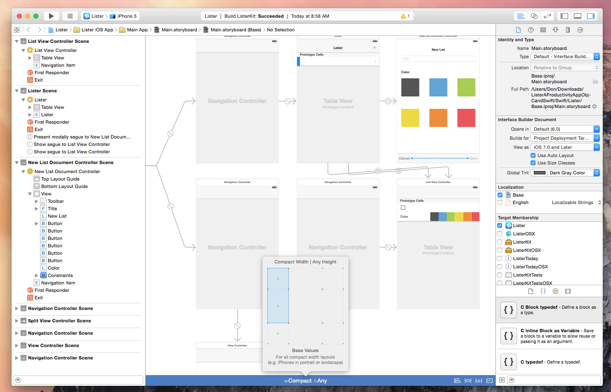
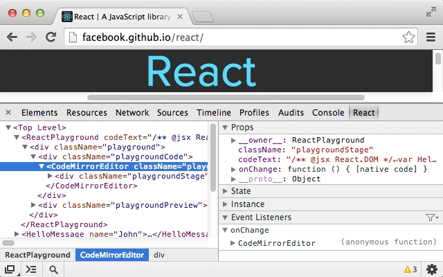
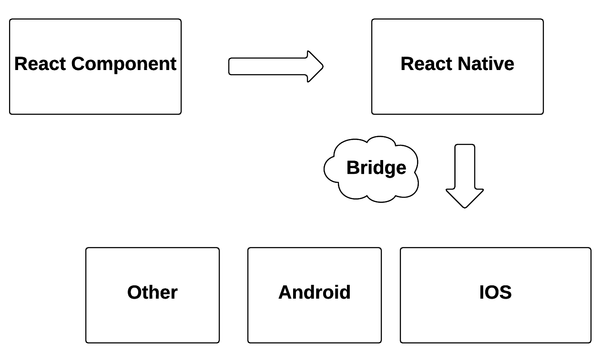

# [fit] Learn Once Write Everywhere

---

# Welcome to Philadelphia


---

# [fit] Clojure is awesome!

---

# Github Stars

ClojureScript: 5309
Clojure: 4734

---

#  `whoami`

```clj
{
:name "Jearvon"
:description "Loves programming"
}
;; Currently enamored with Lisp & Clojure
```

---

# Agenda

---

#  Demo

---

# 2007


[^Image credit]: http://www.technologytell.com/apple/80187/steve-jobs-wanted-Wi-Fi-Spectrum-for-Apples-first-iPhone

---

# 2008


[^1]: https://cdn2.iconfinder.com/data/icons/ios7-inspired-mac-icon-set/1024/_app_store_5122x.png

---

# Objective-C

```objectivec
#import <Foundation/Foundation.h>

int main (int argc, const char * argv[])
{
  NSAutoreleasePool *pool = [[NSAutoreleasePool alloc] init];
  NSLog (@"Hello, Clojure/conj!");
  [pool drain];
  return 0;
}
```

---

# Xcode



[^1]: http://313e5987718b346aaf83-f5e825270f29a84f7881423410384342.r78.cf1.rackcdn.com/1411058188-xcode-6-header.png

---

# Many Platforms


---

# Mobile Version


[^1]: https://abmmediablog.files.wordpress.com/2013/06/nytimes-mobile.png

---

# PhoneGap


[^1]: http://phonegap.com/css/images/graphic_build_bot.png

---

# RubyMotion


[^1]: http://i.imgur.com/mndCd.png

---

# React Native


[^1]: https://fbcdn-dragon-a.akamaihd.net/hphotos-ak-xaf1/t39.2365-6/11057107_805781416175147_684201729_n.png

---

# Leverage the Native Platform

---

# Tooling

---

# Current Workflow

---

# Browser Developer Tools



---

# Editor


---

# React

A JavaScript library for building user interfaces

---

# [fit] Declaritive Views

---

# Components

---

# React

```js
var CommentBox = React.createClass({
  render: function() {
    return (
      <div className="greeting">Hello, Clojure/conj. </div>
    );
  }
});
```

---

# React Native

```js
var React = require('react-native');
var { StyleSheet, Text, View } = React;

var ReactNative = React.createClass({
    render: function() {
	return (
	    <View style={styles.row}>
	    <Text style={styles.title}>Hello, Clojure/conj</Text>
	    </View>
	);
    });
```

---

# React Native

```js
var styles = StyleSheet.create({
    image: { width: 40, height: 40, marginRight: 10 },
    text: { flex: 1, justifyContent: 'center'},
});
```

---



---

# ClojureScript

---

# om

```clj
(defn widget [data owner]
  (reify
    om/IRender
    (render [this]
      (view {:style {:margin 40 :alignItems "center"}}
        (text nil "Hello Clojure/conj")
```

---

# om.next

```clj
(defn widget [data owner]
  (reify
    om/IRender
    (render [this]
      (navigator-ios {:style {:flex 1}
 :initialRoute {:component (om/build search owner) :title "Search"}}))))
```

---

# reagent

```clj
(def row-comp
  (r/reactify-component
    (fn[props]
      (let [row (props :row)]
        [touchable-highlight {:style {:border-top-width 1}}
        [text @row]]))))
```

---

# Ambly

A ClojureScript REPL into iOS JavaScriptCore.

---

# Natal

Bootstrap ClojureScript-based React Native apps

---

# Natal

```sh
$ ls
native
out
project.clj
src
target
```

---

# Natal

```sh
$ natal --help

init [options] <name>  create a new ClojureScript React Native project
launch                 compile project and run in simulator
repl                   launch a ClojureScript REPL with background compilation
xcode                  open Xcode project
```


---

#  Workflow

---

# Should I use this?

---

# Shout outs

* Mike Fikes
* ClojureScript community

---

# Resources

* Slack -> #cljsrn
* http://cljsrn.org
* https://facebook.github.io/react-native/
* Me

---

# Pair With Me

* Twitter: @jearvon
* Email: j.dharrie@gmail.com
* Podcast: http://turing.cool
